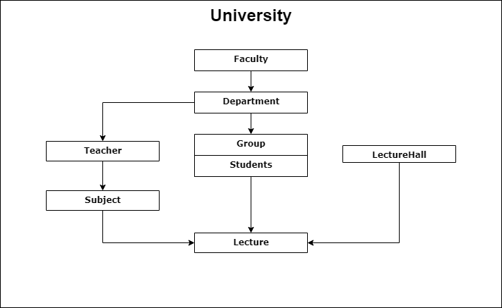
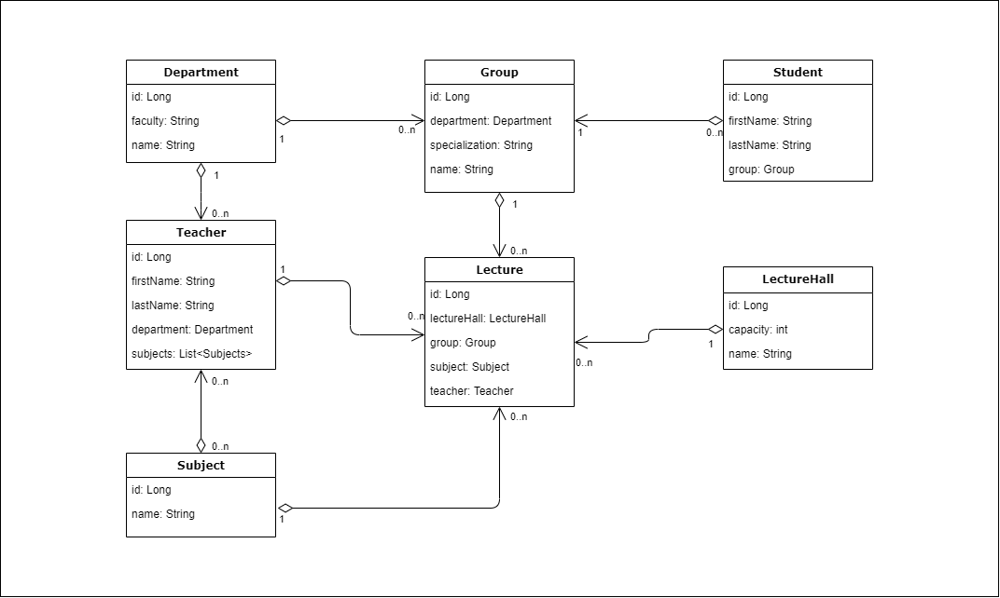

# University schedule API

### Description
This is a REST service built with Spring Boot. It models the structure of the university, and its main task is to build a lecture schedule for a particular student on a particular day.

### Setup
* Clone project
* In the project directory run command `mvn clean package`
* And then `docker-compose up -d`
* After project start you can go to the `http://localhost:8080` and send the requests you need

#### Available requests
* POST: /departments | /groups | /lectures | /lecture-halls | /students | /subjects | /teachers - creates new
* GET: /departments | /groups | /lectures | /lecture-halls | /students | /subjects | /teachers - returns all   
if you add to each /get/{id} you will get item by id
* PUT: add to the GET methods /update/{id}
* DELETE: add to the GET methods /delete/{id}
* Schedule endpoint: `/lectures/get-available?id={id}&date={date}` (Date format: "25.01.2022")

### University structure

### Relations between entities diagram
